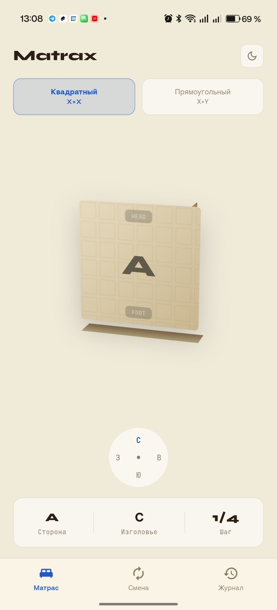
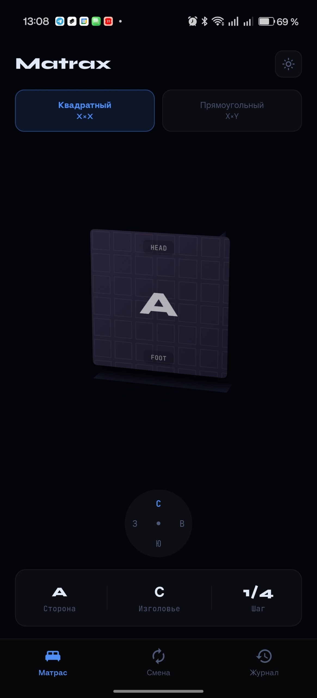

# Matrax

PWA и Android приложение для отслеживания ротации матраса. Подсказывает когда и как переворачивать, ведёт журнал, работает офлайн.

## Скачать

| Платформа | Ссылка |
|-----------|--------|
| 🌐 PWA (браузер) | [auskraft.github.io/matrax](https://auskraft.github.io/matrax/) |
| 📱 Android APK | [Скачать v1.0.0](https://github.com/Auskraft/matrax/releases/tag/v1.0.0) |

## Скриншоты

  
  
  
  

## Что делает

Показывает текущую ориентацию матраса в 3D. Даёт рекомендацию на следующую смену: куда повернуть, какой стороной положить. Пишет в журнал дату, время и тип смены.

Поддерживает два типа матрасов:

**Квадратный** (200×200). Цикл из 4 шагов. Каждая смена = flip + поворот на 90° вправо.

**Прямоугольный** (например, 160×200). Цикл из 2 шагов. Каждая смена = flip + разворот Head↔Foot.

## Экраны

**Матрас.** 3D модель с компасом, выбор типа матраса, текущее состояние. Матрас можно крутить пальцем.

**Смена.** Рекомендация с описанием. Кнопка подтверждения. Экспорт в JSON, сброс.

**Журнал.** Вся история с датой, временем и иконками действий.

## Фичи

- Тёмная и светлая темы
- 3D модель матраса со свайпом
- Тактильный отклик на подтверждении
- Данные хранятся локально, ничего не уходит на сервер
- PWA работает офлайн
- Android APK — нативное приложение на Flutter

## Установка PWA

1. Открыть https://auskraft.github.io/matrax/ в Chrome
2. Меню → «Установить приложение»

## Установка APK

1. Скачать [app-release.apk](https://github.com/Auskraft/matrax/releases/latest)
2. Разрешить установку из неизвестных источников
3. Установить

## Стек

**PWA:** Vanilla JS, HTML, CSS 3D transforms, без зависимостей.

**Android:** Flutter, Dart, Provider, SharedPreferences, Google Fonts.

## Лицензия

MIT
